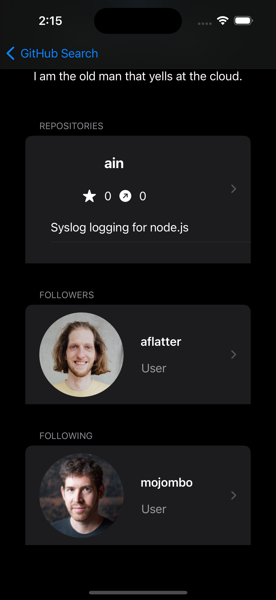
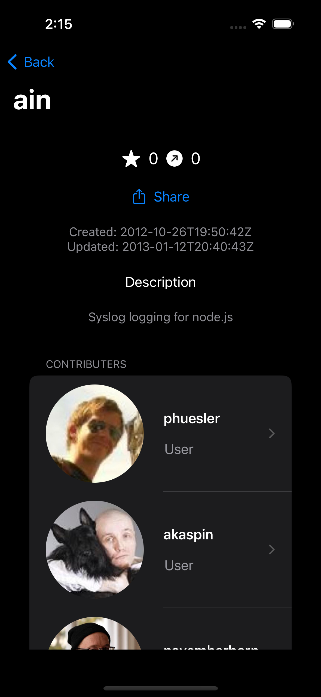

# Git-In-My-Hub

## Description
An iOS app that uses the Open GitHub API to pull user account data into view for the user.
Discover other GitHub user profiles and their repos, share them with others by tapping the share button.

## Screenshots

    

## Libraries
1. Swift
2. SwiftUI

## Installation
1. Clone or Fork the project into XCode
2. Open project
3. Run and Build project into simulator
    a. should work and run out of the box

## Authors

##### Name: Keon Pourboghrat
##### Email: keonpourboghrat@gmail.com

## Other Projects

##### Clipy ######(Chrome Extension): 
<a href="https://chrome.google.com/webstore/detail/clipy/phgclneccgfonapjljmjdjdlfdmdhope">Chrome Store Page</a>
